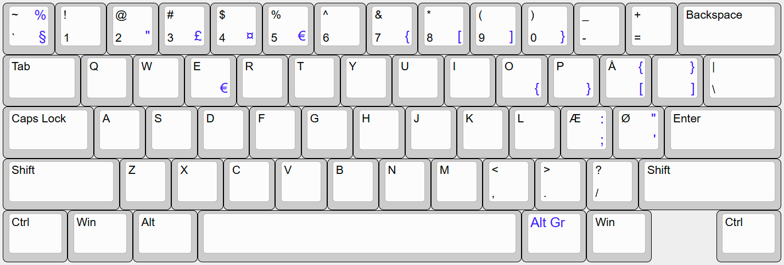

# Dansi Keyboard Layout

Dansi is a custom keyboard layout based on the **[Swerty keyboard layout](https://johanegustafsson.net/projects/swerty/)**, optimized for the Danish language. The design goal for the dansi layout is to retain as much as possible of the standard US layout (also known as the ANSI keyboard layout), while adding Æ, Ø, and Å from the standard Danish layout. 

---

## Installation Guide

1. Download the **dansi.zip** from the [Releases](https://github.com/menzi7/dansi/releases/) section.
2. Extract the zip-file and run **setup.exe**.
3. Once installed, go to **Settings > Time & Language > Language > Keyboard** and select "dansi" from the list of available keyboard layouts.

If you need to modify dansi, you can do so by editing "dansi.klc" with [Microsoft Keyboard Layout Creator](https://www.microsoft.com/en-us/download/details.aspx?id=102134).

---

## Uninstallation Guide

1. Go to **Settings > Apps > Installed Apps**.
2. Locate "dansi" in the list of programs.
3. Click **Uninstall** and follow the prompts to remove it.

---

## Contributing
If you have suggestions, find bugs, or want to contribute improvements, feel free to open an issue or submit a pull request on the repository.

---

## License
This project is licensed under the [MIT License](LICENSE).

---

Enjoy dansi!
